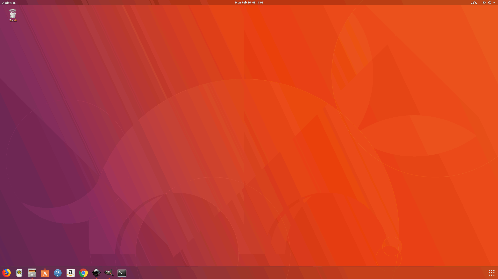

# Gnome Shell Snap To Neighbors

This is a simple shell extension to quickly tile your windows in a more ad-hoc
way than most tiling schemes. Instead of making an entire workspace behave like
a Ion-style tiling window manager you can, with a quick keyboard shortcut, snap
a single window to fill the space between neighboring windows. 



## Installation 

Clone the repository and symlink or copy it to the extensions folder:

``` 
git clone https://github.com/tpyl/gssnaptoneighbors.giti
ln -s ~/gssnaptoneighbors.git ~/.local/share/gnome-shell/extensions/gssnaptoneighbors@tpyl.github.io
```
You then have to enable the extension either through gnome-tweak-tool, or by installing
the extension web plugin and going to https://extensions.gnome.org/local/. 

Notice that the plugin was developed on Ubuntu 17.10, and in metadata.json is only flagged
to work with gnome shell 3.26.2. It will likely work with many other versions as well, but
you may have to add your version to the list. 


## Configuration

There is a single keyboard shortcut you can configure. Probably this should be
linked to dconf, somehow, but I can't be bothered. You can easily edit it in
`schemas/org.gnome.shell.extensions.snaptoneighbors.gschema.xml` and then run
`glib-compile-schemas  .`

There are some additional values you can tweak at the top of `extension.js`, but
the default values should be good, unless you have highly customized visuals on
your desktop.

The default keyboard shortcut is *CTRL+ALT+S*

# How it works

When you press the hotkey, the currently active window is resized to fit the
available space. From the top left corner of the window, the maximum available
horizontal space is first determined along a thin area. This allows the window
to potentially reduce it's hight, but increase it's width to fill up empty
space. Once the maximum horizontal area is determined, the maximal vertical
expansion is determined so that the window will not overlap any other window.

A similar process is tried again, but this time starting first with thin
vertical scan followed by horizontal expansion. Out of these two possible
results, the one that yields the larger surface area is selected. 

In practice, just remeber that the expansion happens from the top left corner of
the window and is not related in any way to to the current size of the window. 
